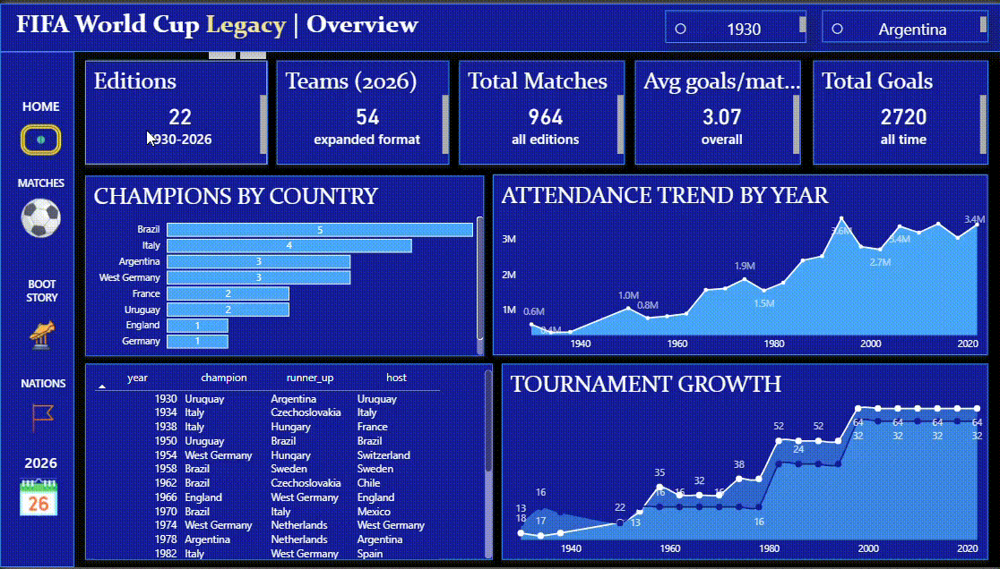
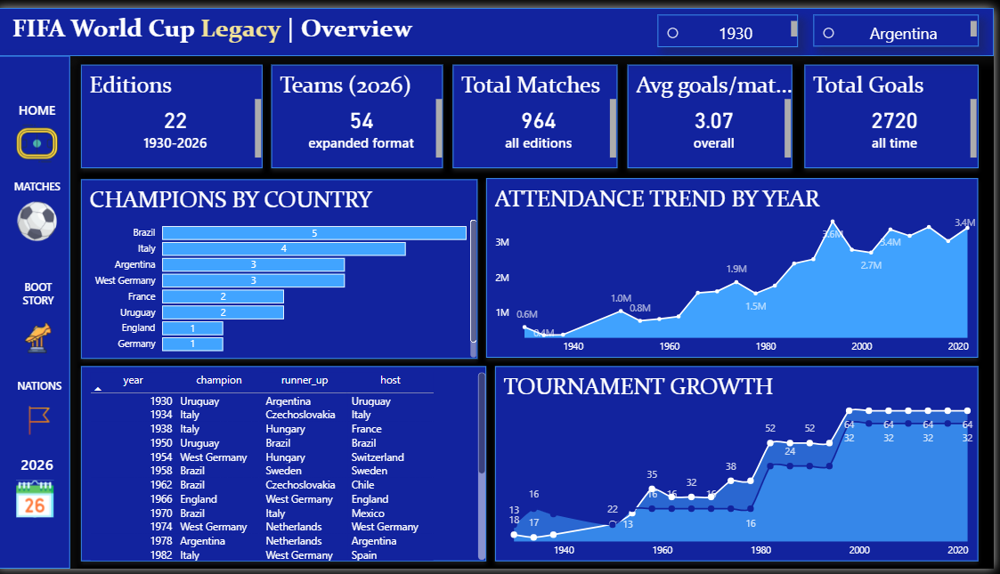
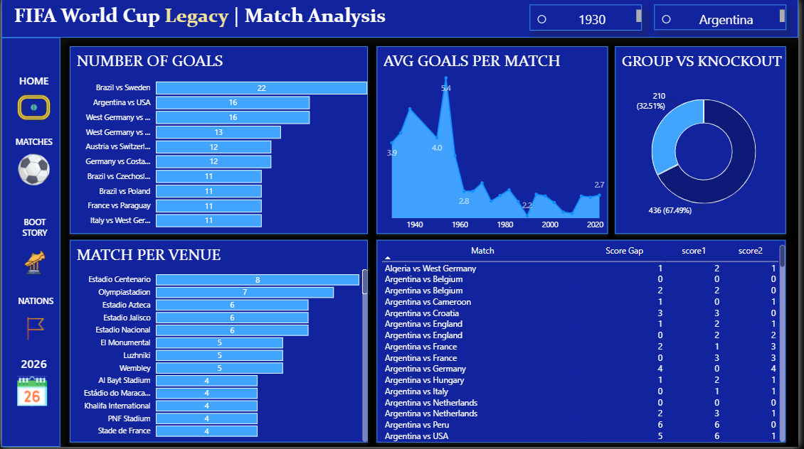
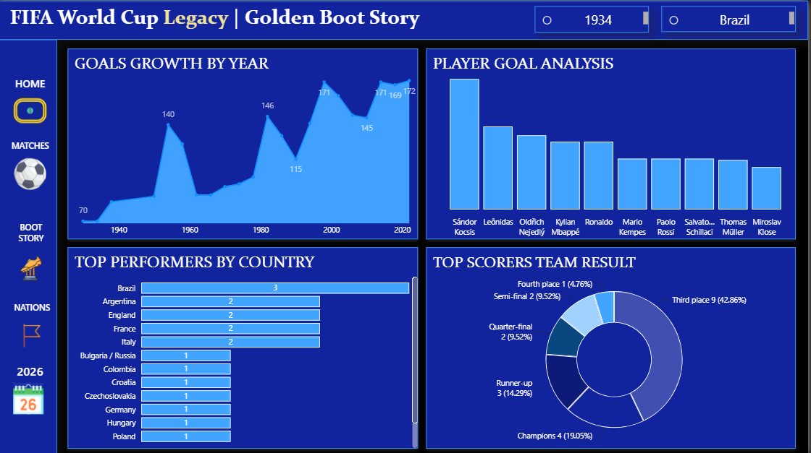
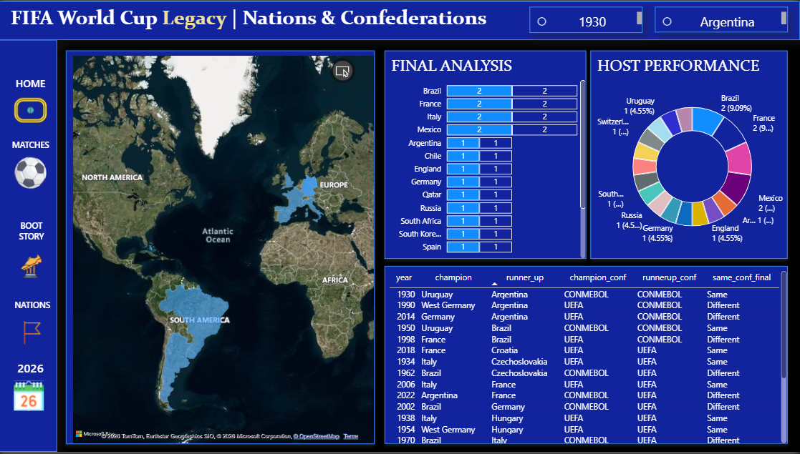
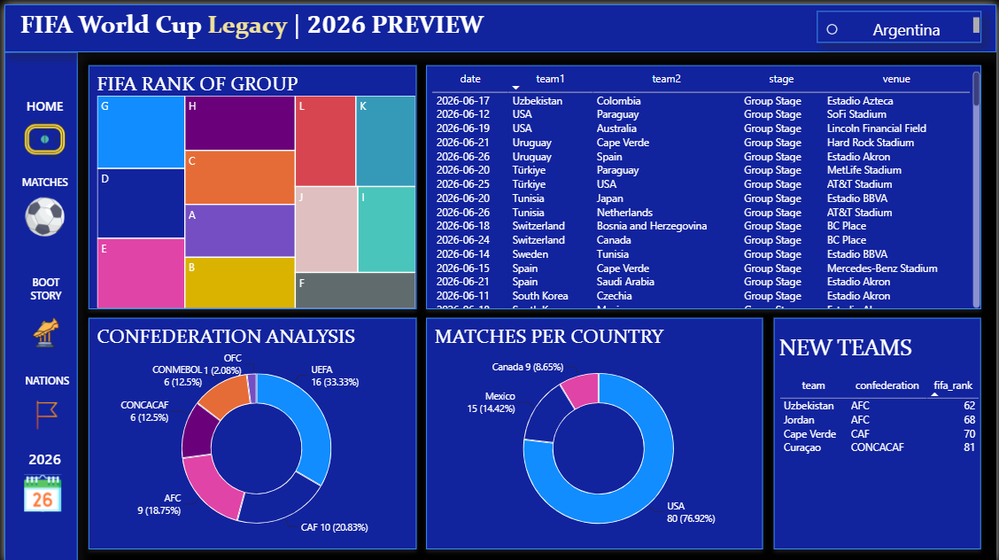

# FIFA World Cup Legacy Dashboard

## Dashboard Demo

## Project at a Glance

| Metric | Value |
|----------|-------|
| World Cup Editions Covered | 22 (1930–2026) |
| Matches Analyzed | 964 |
| Goals Analyzed | 2,720 |
| Participating Teams | 54 (2026 format included) |
| Dashboard Pages | 5 |
| Interactive Visuals | 25+ |
| Custom DAX Measures | 15+ |
| Slicers & Filters | Dynamic Year & Country |
| Tech Stack | Power BI, DAX, Power Query |
## Overview

**FIFA World Cup Legacy** is a multi-page interactive Power BI dashboard that analyzes the complete history of the FIFA World Cup from **1930 to 2026**. The project combines historical tournament data, match statistics, player achievements, confederation analysis, and a preview of the 2026 edition into a single analytical platform.

The goal of this project is to demonstrate how sports data can be transformed into actionable insights using modern Business Intelligence techniques.

---

## Dashboard Preview

### 1. Tournament Overview

* Total World Cup editions
* Participating teams
* Total matches played
* Average goals per match
* Total goals scored
* Champions by country
* Attendance trend over time
* Tournament growth analysis

### 2. Match Analysis

* Highest scoring matches (Top 10)
* Goals trend by tournament year
* Group Stage vs Knockout Stage comparison
* Matches played by venue
* Biggest upsets (highest goal difference)

### 3. Golden Boot Story

* Goals growth across tournaments
* Top goal scorers analysis
* Golden Boot winners by country
* Tournament performance of top scorers

### 4. Nations & Confederations

* World map of participating nations
* Champions and runners-up analysis
* Host nation performance
* Confederation comparison and final appearances

### 5. FIFA World Cup 2026 Preview

* Group stage composition
* Confederation representation
* Matches hosted by country
* New teams participating in the expanded 2026 format
* Tournament schedule overview

---

## Key Features

* Interactive multi-page Power BI report
* Dynamic year and country slicers
* Cross-filtering across all visuals
* Football-themed dashboard UI
* Custom DAX measures and calculated columns
* Data modeling with multiple related tables
* Historical and predictive storytelling approach

---

## Tech Stack

* **Power BI Desktop**
* **Power Query**
* **DAX (Data Analysis Expressions)**
* **Data Modeling**
* **Microsoft Excel / CSV Data Sources**

---

## Key DAX Calculations

Some of the custom calculations used in the project include:

* Total Goals
* Average Goals per Match
* Total Matches
* Score Gap (Biggest Upsets)
* Tournament Growth Metrics
* Attendance Aggregations
* Country-wise and Confederation-wise KPIs

---

## Business Questions Answered

* Which countries have dominated World Cup history?
* How has tournament participation evolved over time?
* Which matches produced the highest number of goals?
* Which venues have hosted the most matches?
* How have attendance figures changed across decades?
* Which nations produce the most Golden Boot winners?
* How are confederations represented in the 2026 World Cup?
* What are the biggest upsets in World Cup history?

---

## Skills Demonstrated

* Data Cleaning & Transformation
* Data Modeling
* DAX Development
* Interactive Dashboard Design
* KPI Development
* Time-Series Analysis
* Sports Analytics
* Data Storytelling

---

## Project Highlights

* Covers **95+ years of FIFA World Cup history**
* Includes **5 fully interactive dashboard pages**
* Combines historical analysis with **2026 World Cup preview**
* Designed with a custom football-inspired theme for an engaging user experience

---
## Dashboard Screenshots

| Tournament Overview | Match Analysis |
|---------------------|----------------|
|  |  |

| Golden Boot Story | Nations & Confederations |
|-------------------|--------------------------|
|  |  |

| FIFA World Cup 2026 Preview |
|-----------------------------|
|  |
---

## Author

**Mohan**

If you found this project interesting, feel free to connect or provide feedback!
